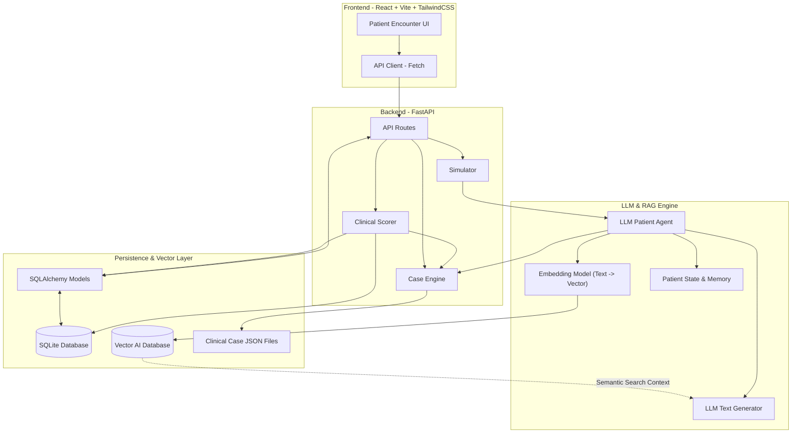

# DiagnOS – Current Technology Stack & Architecture

## 🛠️ Tech Stack Overview

### 1. Frontend — Client Side

**Core Framework:** React + Vite (JavaScript/JSX)
The frontend is a React single-page application built and served using Vite. It manages the user interface, simulation screens, patient interactions, case selection, diagnosis submission, and evaluation results.

**Styling:** TailwindCSS
TailwindCSS is used for responsive layouts, utility-based styling, gradients, cards, animations, and the overall DiagnOS interface.

**Icons:** Lucide React
Lucide React provides the SVG icons used throughout the application.

**API Communication:** Custom JavaScript API client
The frontend communicates with the FastAPI backend through a custom API client using the native Fetch API. It sends and receives JSON data for simulation sessions, patient interactions, case information, and evaluation results.

---

### 2. Backend — Application Server

**Framework:** FastAPI (Python)
FastAPI provides the REST API layer connecting the React frontend with the simulation engine, case engine, AI modules, and database.

**Data Validation:** Pydantic
Pydantic models validate API request and response data and ensure that the backend receives correctly structured information.

**Database ORM:** SQLAlchemy
SQLAlchemy provides the database abstraction layer and maps Python models to relational database tables.

**Database:** SQLite
SQLite is currently used for persistent storage. The database stores application and simulation-related information such as cases, sessions, conversations, and evaluations.

**Testing:** Pytest + FastAPI TestClient
Pytest is used for backend testing, while FastAPI's TestClient allows API endpoints to be tested without running the complete application externally.

---

## 🧠 3. Generative AI & Vector Search Layer

DiagnOS utilizes an advanced **LLM-driven architecture with RAG (Retrieval-Augmented Generation)** to simulate dynamic, highly realistic patient encounters.

### Patient Agent — `patient_agent.py`

The Patient Agent acts as the central orchestrator for the simulated patient encounter.

It coordinates the patient's responses and maintains the state of the ongoing interaction by working with the patient state, memory, emotional state, and response mechanisms.

### Patient State — `patient_state.py`

Maintains the current state of the simulated patient, including relevant clinical and conversational state information.

### Patient Emotion — `patient_emotion.py`

Tracks the patient's emotional condition during the conversation.

The patient's emotional state can change depending on the student's interaction and communication.

Examples include:

* Fear
* Anxiety
* Anger
* Trust
* Distress

### Patient Memory — `patient_memory.py`

Maintains information from the ongoing conversation so that the simulated patient can retain relevant previous interactions during the encounter.

### Dynamic LLM Responder

Replaces the legacy deterministic offline responder. 
It uses a generative Large Language Model (e.g. OpenAI / Llama) to formulate natural, nuanced, and empathetic clinical responses.

### Vector AI Database (Chroma / Pinecone)

Stores clinical cases, historical dialogue examples, and medical guidelines as dense **semantic embeddings**.

### Embeddings Pipeline

Transforms the student's natural language questions into vector spaces using an embedding technique (e.g. `text-embedding-3-small`). It searches the Vector AI Database to fetch the most contextually relevant clinical constraints and feeds them into the LLM prompt (RAG).

### Communication Analyzer — `communication_analyzer.py`

Evaluates the student's communication with the simulated patient.

It analyzes the student's statements/questions and identifies communication characteristics that can contribute to the evaluation of the encounter.

### Simulator — `simulator.py`

Acts as the bridge between the AI/simulation components and the backend API.

It coordinates the patient simulation process and exposes the AI functionality to the FastAPI application.

---

## 📚 4. Case Engine

DiagnOS stores clinical scenarios as structured **JSON case files**.

The case engine is responsible for loading and providing case-specific information to the simulation.

Case data can contain information such as:

* Patient demographics
* Chief complaint
* Symptoms
* Medical history
* Family history
* Medications
* Clinical findings
* Expected diagnosis
* Management information
* Evaluation criteria

The case engine provides the structured clinical information required by the Patient Agent and evaluation system.

---

## 🎯 5. Clinical Evaluation / Scoring

DiagnOS uses a hybridized **LLM Clinical Judge** combined with deterministic rule-based matrices.

The scoring system evaluates the student's decisions against the predefined clinical information and evaluation criteria stored in the case data.

The evaluation can consider factors such as:

* Questions asked by the student
* Relevant information collected
* Clinical reasoning
* Diagnosis
* Immediate management priority
* Evidence supporting the diagnosis
* Communication quality
* Appropriate or inappropriate clinical actions

The resulting evaluation is stored in the database and returned to the frontend.

---

# 🏗️ Current DiagnOS Architecture

# 🔄 How Data Flows During a Patient Simulation

### 1. Case Selection

The student selects a clinical case from the React frontend.

The frontend sends the request to the FastAPI backend through the API client.

### 2. Simulation Initialization

FastAPI initializes the simulation and loads the selected case from the **JSON-based Case Engine**.

The Patient Agent is initialized with the case information and creates the required patient state, emotional state, and conversation memory.

### 3. Student Interaction

The student asks questions or communicates with the simulated patient through the React interface.

The request is sent:

**React → API Client → FastAPI → Simulator → Patient Agent**

The Patient Agent uses the patient's current state, memory, emotional state, case information, and Offline Responder to generate the appropriate deterministic response.

### 4. Emotional & Conversational State

As the encounter continues, the system updates:

**Patient State → Patient Emotion → Patient Memory**

This allows the patient's behavior and emotional response to change according to the student's interaction.

### 5. Communication Analysis

The student's communication is processed by the **Communication Analyzer**, which evaluates communication-related aspects of the interaction.

### 6. Clinical Evaluation

When the student submits their diagnosis and clinical decisions, the backend sends the relevant encounter information to the **Clinical Scorer**.

The scorer compares the student's performance against the predefined case-specific evaluation criteria.

### 7. Persistence

The resulting session and evaluation information are persisted through:

**FastAPI → SQLAlchemy → SQLite**

### 8. Results

The final evaluation is returned through the FastAPI API:

**SQLite / Scorer → FastAPI → API Client → React UI**

The frontend then displays the student's score and evaluation results.

---

# 🔑 Architectural Characteristics

The current DiagnOS platform is therefore:

* **React + Vite** frontend
* **TailwindCSS** for UI styling
* **FastAPI + Python** backend
* **Pydantic** for API validation
* **SQLAlchemy + SQLite** for persistence
* **JSON-based clinical case engine** synchronized with semantic vectors
* **Generative LLM-based patient simulation**
* **Vector AI Database** for natural language pattern matching (RAG)
* **Embedding Techniques** to map clinical symptom queries
* **Patient state, emotion, and memory management** inside prompt context
* **LLM + Rule-based clinical scoring judge**

The overall architecture can be summarized as:

**React UI → FastAPI → Simulation Engine → Patient Agent + AI Modules → Case Engine / Scoring → SQLAlchemy → SQLite → Evaluation Results → React UI**
